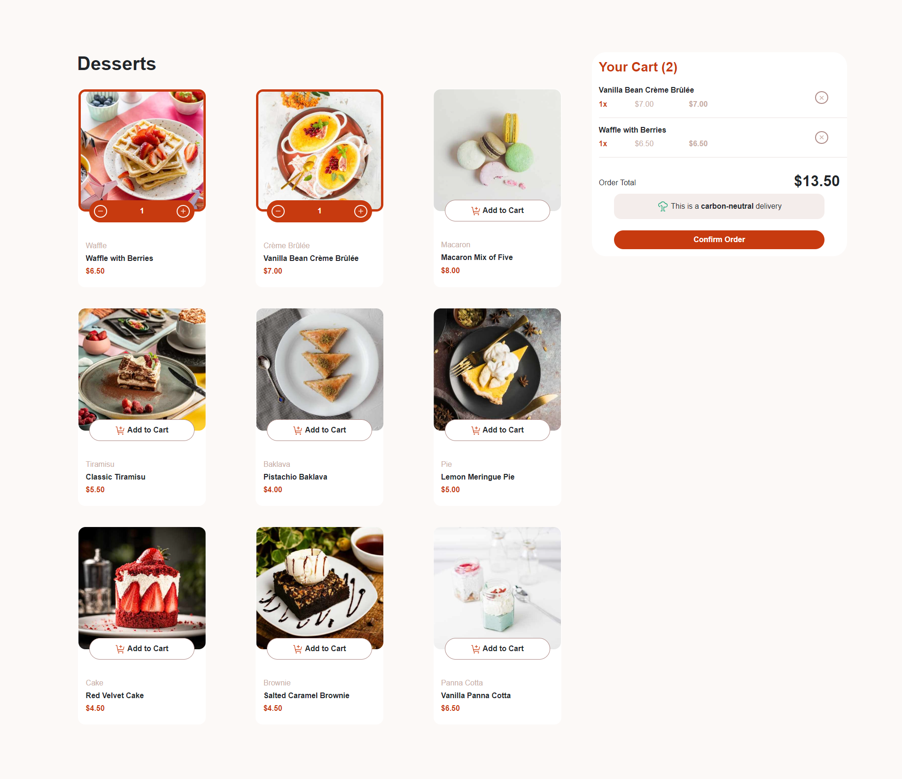
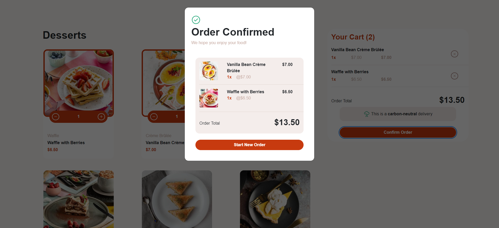

# Product list with cart

## Table of contents

- [Resumo / Overview](#resumo--overview)
  - [Screenshot](#screenshot)
- [O meu processo / My process](#o-meu-processo--my-process)
  - [Construído com / Built with](#construído-com--built-with)
  - [What I learned](#what-i-learned)
  - [Continued development](#continued-development)
  - [Useful resources](#useful-resources)
- [Author](#author)
- [Acknowledgments](#acknowledgments)


## Resumo / Overview

 Este projeto consiste no desenvolvimento do backend de uma aplicação web com C# ASP.NET.
 No mesmo foi criada uma API REST que exerce funções vistas em plataformas de e-commerce, nomeadamente:
 - Adicionar produtos a um carrinho;
 - Ajustar a quantidade de um produto no carrinho;
 - Obter o conteúdo do carrinho;
 - Remover todo o conteúdo do carrinho;
 - Obter os produtos da plataforma.

==========================================================================

 This project consists on the development of the backend of a web app with C# ASP.NET.
 A REST API was created within this project, this API executes functions seen in e-commerce platforms, mainly:
 - Add products to a cart;
 - Adjust a product's quantity on the cart;
 - Get the contents of the cart;
 - Remove all the content from the cart;
 - Get the products from the platform.

### Screenshot





## O meu processo / My process

 O desenvolvimento deste projeto começou com uma fase de planeamento, na qual se determinou que se deveria dar prioridade à implementação das rotas da API associadas ao carrinho e aos produtos da plataforma.
 Após a fase de planeamento, implementaram-se as seguintes rotas:
 - GET    /products       -> Obtém os produtos da plataforma
 - GET    /cart           -> Obtém os produtos no carrinho
 - POST   /cart           -> Adiciona um produto ao carrinho
 - DELETE /cart/{id:int}  -> Remove um produto do carrinho
 - PUT    /cart/{id:int}  -> Ajusta a quantidade de um produto no carrinho
 - DELETE /cart           -> Remove todos os produtos do carrinho

 Uma vez implementadas estas rotas, iniciou-se a implementação do frontend.
 Para o efeito recorreu-se ao Blazor, porém de forma a que fosse possível implementar todas as funcionalidades do frontend dependeu-se mais do JavaScript.
 No frontend criaram-se métodos que realizam chamadas AJAX de forma a obter e atualizar o conteúdo do carrinho e do catálogo.

 Após a implementação do frontend, criou-se um base de dados em SQLite na qual seriam armazenados os dados da aplicação. Nesta base de dados constam as seguintes tabelas:
 - products
  - name      -> Nome do produto
  - image     -> String JSON com os caminhos para as imagens de um produto
  - category  -> Categoria do produto
  - price     -> Preço por unidade do produto

 - users
  - id        -> ID do utilizador
  - email     -> Email do utilizador
  - password  -> Password do utilizador
  - role      -> Role do utilizador

 - orders
  - id        -> ID da ordem
  - userEmail -> Email do utilizador que submeteu a ordem
  - orderJSON -> String JSON com os dados dos produtos associados à ordem

 Assim que se incluiu a base de dados no projeto, adicionaram-se as seguintes rotas para a gestão de utilizadores:
  - GET   /users          -> Obtém os dados de todos os utilizadores
  - GET   /user/{id:int}  -> Obtém os dados de um utilizador, com recurso ao ID do mesmo
  - POST  /register       -> Cria um novo utilizador com a role 'client'
  - POST  /login          -> Faz login de um utilizador
  - POST  /logout         -> Faz logout de um utilizador

 De forma a que fosse possível armazenar e consultar os pedidos realizados por um utilizador também se implementaram as seguintes rotas:
  - POST  /submit-order         -> Adiciona uma ordem à base de dados
  - GET   /orders               -> Obtém todas as ordens armazenadas na base de dados
  - GET   /user-orders/{id:int} -> Obtém todas as ordens realizadas por um utilizador com um determinado ID
 
 Após a implementação das rotas e funções referidas anteriormente, foram realizadas umas alterações ao código de forma garantir que o frontend se ajustava consoante o tamanho do ecrã e o bom funcionamento do projeto tanto no frontend como no backend.

==========================================================================

 The development of this project started with a planning phase, in which was decided that priority should be given to the implementation of the API routes that are associated to either the cart or the products of the platform.
 After the planning phase, the following routes were implemented:
 - GET    /products       -> Gets the products of the platform
 - GET    /cart           -> Gets the products in the cart
 - POST   /cart           -> Adds a product to the cart
 - DELETE /cart/{id:int}  -> Removes a product from the cart
 - PUT    /cart/{id:int}  -> Changes a product's quantity in the cart
 - DELETE /cart           -> Removes every product from the cart

 Once this routes were implemented, the implementation of the fronteend began.
 For this purpose Blazor was chosen; however, in order to implement every function needed in the frontend its implementation relied heavily on JavaScript.
 Within the frontend, methods which execute AJAX calls in order to get and update the contents of both the catalogue and the cart were implemented.

 Once the frontend was implemented, a SQLite database in which the app's data would be stored was created. Within this database the following tables can be found:
 - products
  - name      -> Product's name
  - image     -> JSON string with the paths to a product's images
  - category  -> Product's category
  - price     -> Product's price per unit

 - users
  - id        -> User's ID
  - email     -> User's email
  - password  -> User's password
  - role      -> User's role

 - orders
  - id        -> Order's ID
  - userEmail -> Email from the user who submitted the order
  - orderJSON -> JSON string with the data from the products associated with the order

 Once the database was included in the project, the following routes for user management were added:
  - GET   /users          -> Gets data from every user
  - GET   /user/{id:int}  -> Gets data from a user through its ID
  - POST  /register       -> Creates a new user with the 'client' role
  - POST  /login          -> Logs in an user
  - POST  /logout         -> Logs out an user

 In order to store and see the order made by the app's users the following routes were implemented:
  - POST  /submit-order         -> Adds an order to the database
  - GET   /orders               -> Gets every order stored in the database
  - GET   /user-orders/{id:int} -> Gets every order made by user with a given ID
 
 After implementing every route and function referred previously, the code suffered slight alterations in order to ensure that the frontend adapts to the screen's size and that the project works as intended in both the frontend and backend.

### Construído com / Built with

- Semantic HTML5 markup
- CSS
- JavaScript
- [Bootstrap](https://getbootstrap.com/)
- [JQuery](https://jquery.com/)
- [ASP.NET Core](https://dotnet.microsoft.com/en-us/apps/aspnet)
- [Blazor](https://dotnet.microsoft.com/pt-br/apps/aspnet/web-apps/blazor)
- [Entity Framework Core](https://github.com/dotnet/efcore)
- [SQLite](https://www.postgresql.org/)

### What I learned

Use this section to recap over some of your major learnings while working through this project. Writing these out and providing code samples of areas you want to highlight is a great way to reinforce your own knowledge.

To see how you can add code snippets, see below:

```html
<h1>Some HTML code I'm proud of</h1>
```
```css
.proud-of-this-css {
  color: papayawhip;
}
```
```js
const proudOfThisFunc = () => {
  console.log('🎉')
}
```

If you want more help with writing markdown, we'd recommend checking out [The Markdown Guide](https://www.markdownguide.org/) to learn more.

**Note: Delete this note and the content within this section and replace with your own learnings.**

### Continued development

Use this section to outline areas that you want to continue focusing on in future projects. These could be concepts you're still not completely comfortable with or techniques you found useful that you want to refine and perfect.

**Note: Delete this note and the content within this section and replace with your own plans for continued development.**

### Recursos Úteis / Useful resources

- [Playlist com Tutoriais de ASP.NET](https://www.youtube.com/playlist?list=PLdo4fOcmZ0oWunQnm3WnZxJrseIw2zSAk) - Este recurso mostrou-se importante, na realização deste desafio uma vez que agilizou a introdução ao desenvolvimento com ASP.NET
- [Playlist com Tutoriais de Blazor](https://www.youtube.com/playlist?list=PLdo4fOcmZ0oXNZX1Q8rB-5xgTSKR8qA5k) - 
- [Documentação Relativa às Sessões](https://learn.microsoft.com/en-us/aspnet/core/fundamentals/app-state?view=aspnetcore-8.0) -
- [Tutorial sobre Autorização com Recurso a Sessões ](https://medium.com/@KumarHalder/session-based-authorization-in-asp-net-core-95eed1d3dded)

**Note: Delete this note and replace the list above with resources that helped you during the challenge. These could come in handy for anyone viewing your solution or for yourself when you look back on this project in the future.**

## Author

- GitHub - [MrTw1ce](https://github.com/MrTw1ce)
- LinkIn - [Lucas Martins](https://www.linkedin.com/in/lucas-martins-657aa8325/)
